<!-- ## About this app -->

<!-- The publication by the OECD of [embodied CO2 indicators](http://oe.cd/io-co2) has fostered new demand for specific tailored calculations beyond the scope of the OECD's resources. -->

## About the data

The CO2 emission factors EF used in the OECD ICIO system to estimate consumption-based emissions are calculated from the [International Energy Agency (IEA) CO2 emissions from fuel combustion](http://www.iea.org/statistics/topics/co2emissions/). In a first step, production-based CO2 emissions by industry are estimated from the IEA data. The differences in the country totals between the IEA's sectoral approach data and the OECD's production-based data, see "Comparison of OECD with IEA" below, are due to the reallocation of emissions associated with non-resident fuel purchases. In a second step, emission factors EFtr[i] for industry i are calculated for each country r and year t as CO2 emissions per unit of industry output. These emission factors can be visualized below in order to inform the interested user about the data used in the calculations for embodied CO2 emissions.

<!-- <iframe src="http://10.101.26.220:3838/co2intensityviz/" width = "100%" style="border: 0px; height: 53em"></iframe> -->
<!-- <iframe src="http://www.icio.oecd.org:3838/co2intensityviz/" width = "100%" style="border: 0px; height: 53em"></iframe> -->
<iframe src="http://oecd-icio.cloudapp.net:3838/co2intensityviz/" width = "100%" style="border: 0px; height: 53em"></iframe>

## Comparision of OECD with IEA

The difference between the IEA data (CO2 emissions from fuel combustion, sectoral approach) and the OECD data (Production-based CO2 emission estimates) are due to the reallocation of CO2 emissions associated with fuel purchases by non-residents. More information is available at [oe.cd/io-co2](http://oe.cd/io-co2).

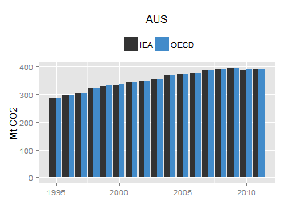 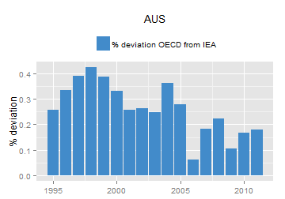  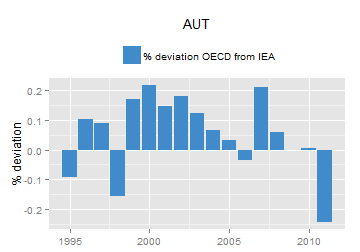 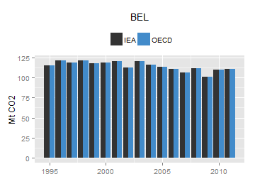    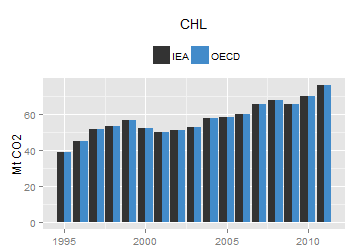   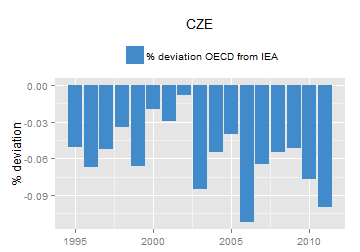 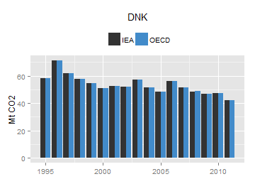 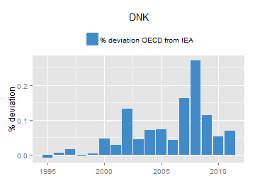  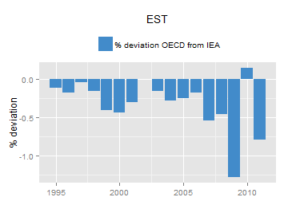  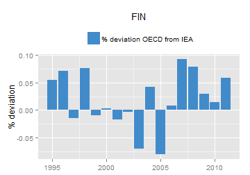   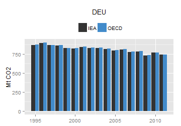  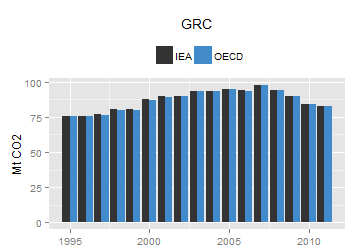 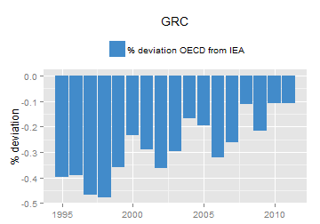 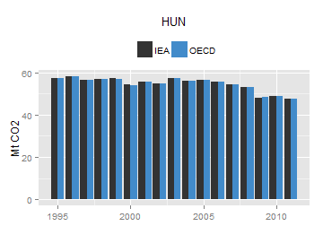    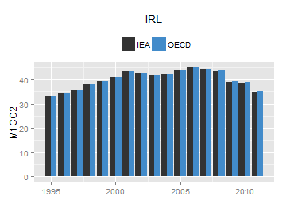  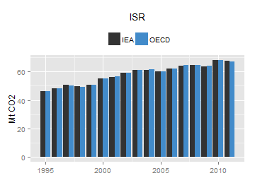 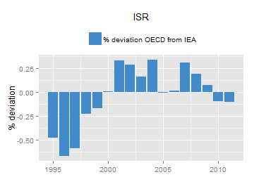 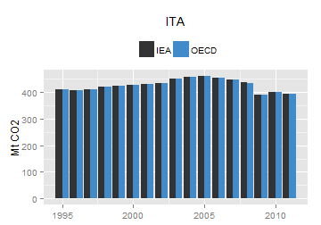 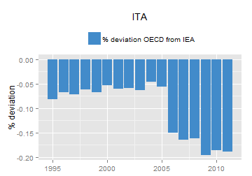  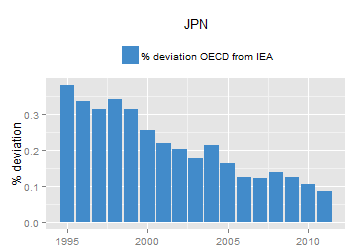  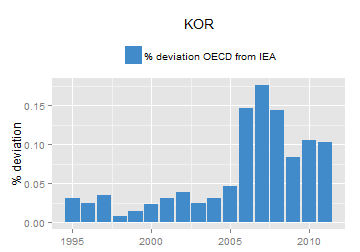 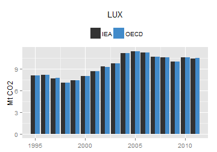    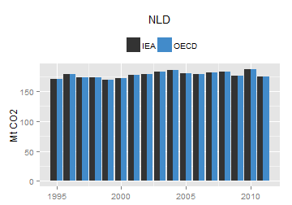    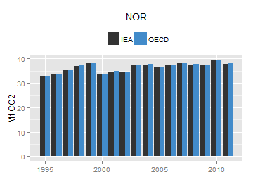 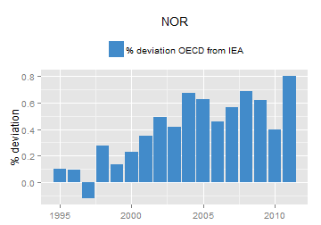  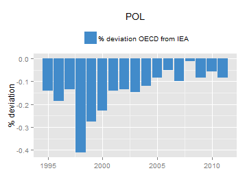 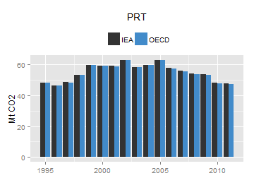  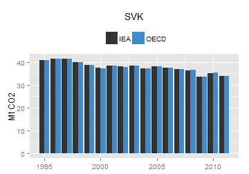 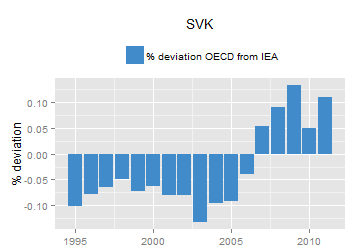 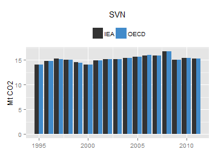  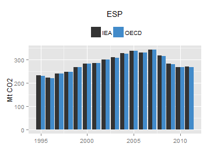  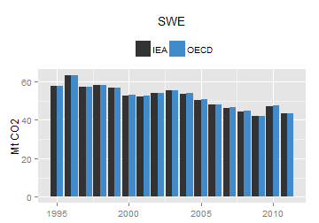   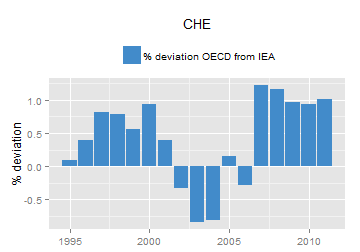     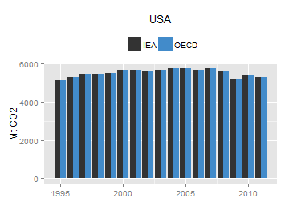  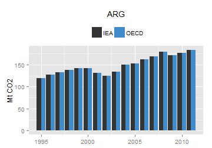     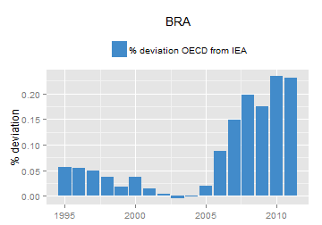  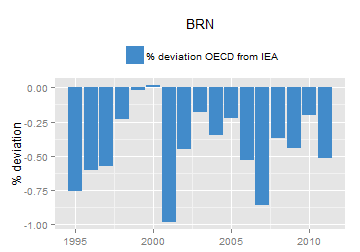  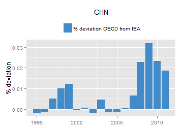    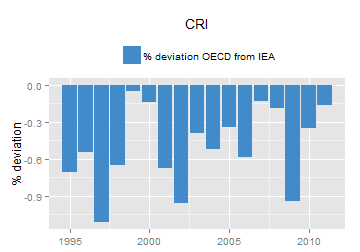 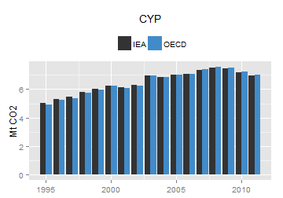  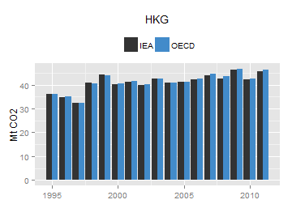 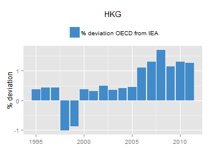 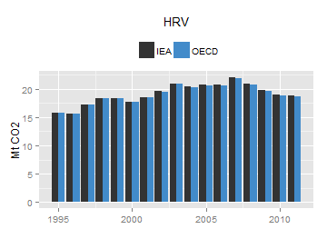 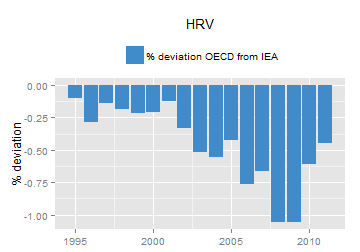   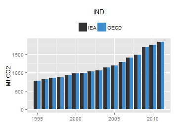 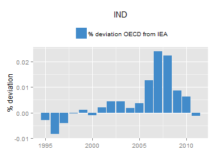 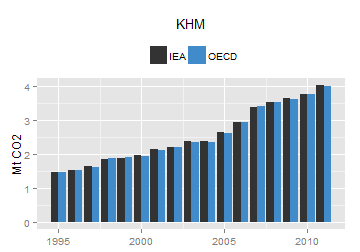 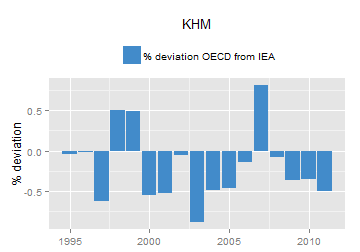 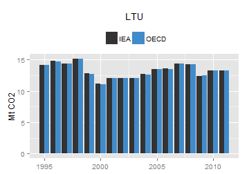   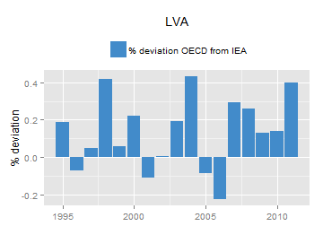                           

