<!-- ## About this app -->

<!-- ## About the data -->

<!-- not yet published -->
<!-- <iframe src="http://10.101.26.220:3838/embodiedco2viz/" width = "100%" style="border: 0px; height: 48em"></iframe> -->
<!-- <iframe src="http://www.icio.oecd.org:3838/embodiedco2viz/" width = "100%" style="border: 0px; height: 48em"></iframe> -->

## Embodied CO2 Emissions for Partner "World"

<!-- ### Plot Legend -->

- `FD_CO2` = consumption-based CO2 emissions
- `PROD_CO2` = production-based CO2 emissions
- `in Mt` = million tonnes CO2

- `FD_PCCO2` = consumption-based CO2 emissions per capita
- `PROD_PCCO2` = production-based CO2 emissions per capita

See also [CO2 Intensity]({{ site.url }}/co2intensity)

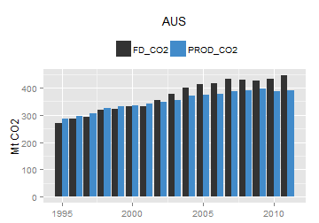    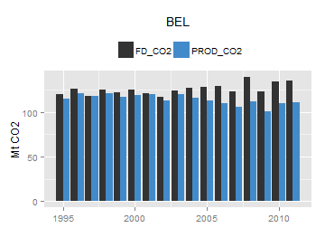  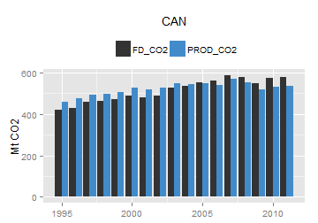         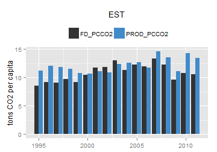            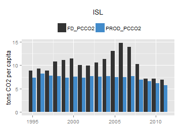  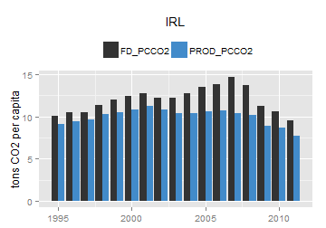     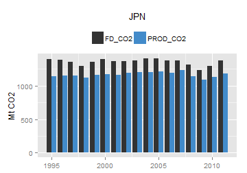 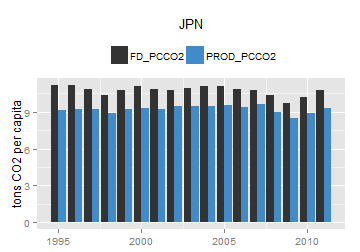 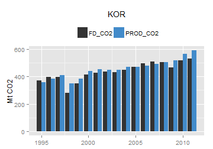    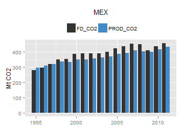   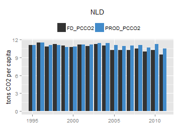 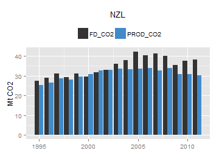 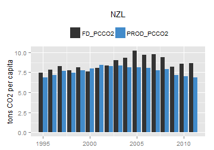      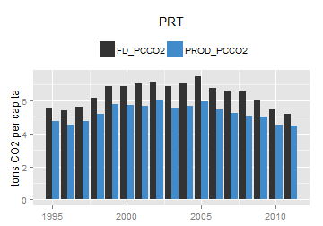       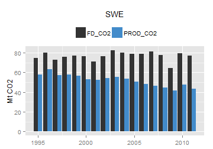  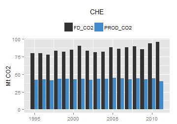   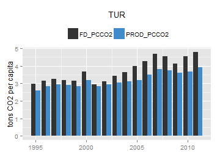           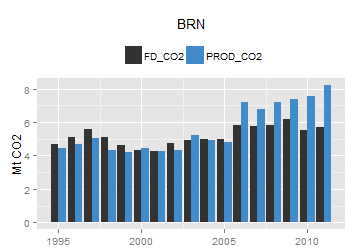  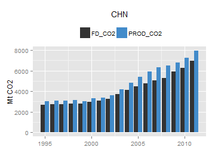 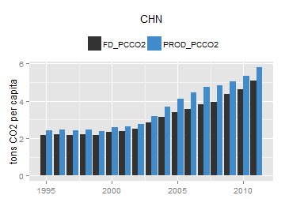 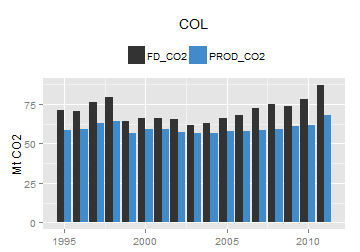          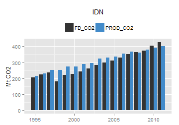  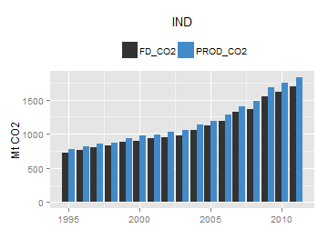       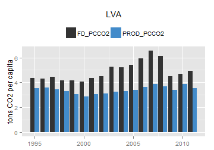  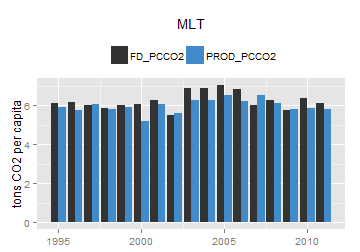 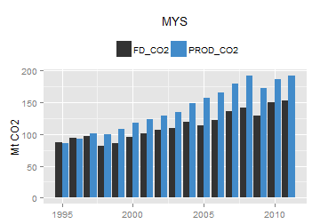  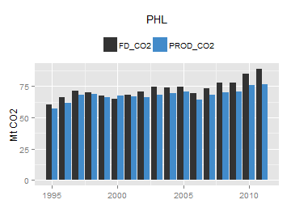 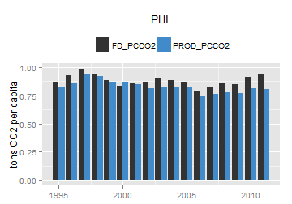  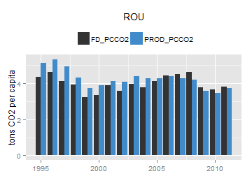   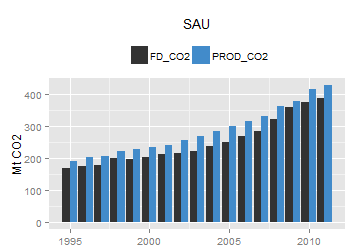  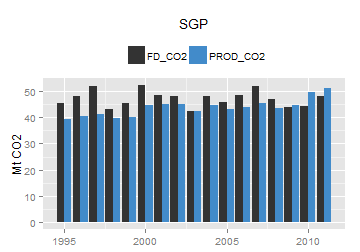  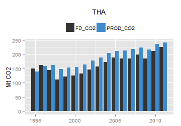       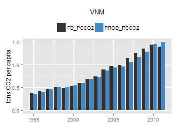   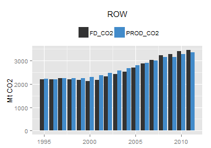  
